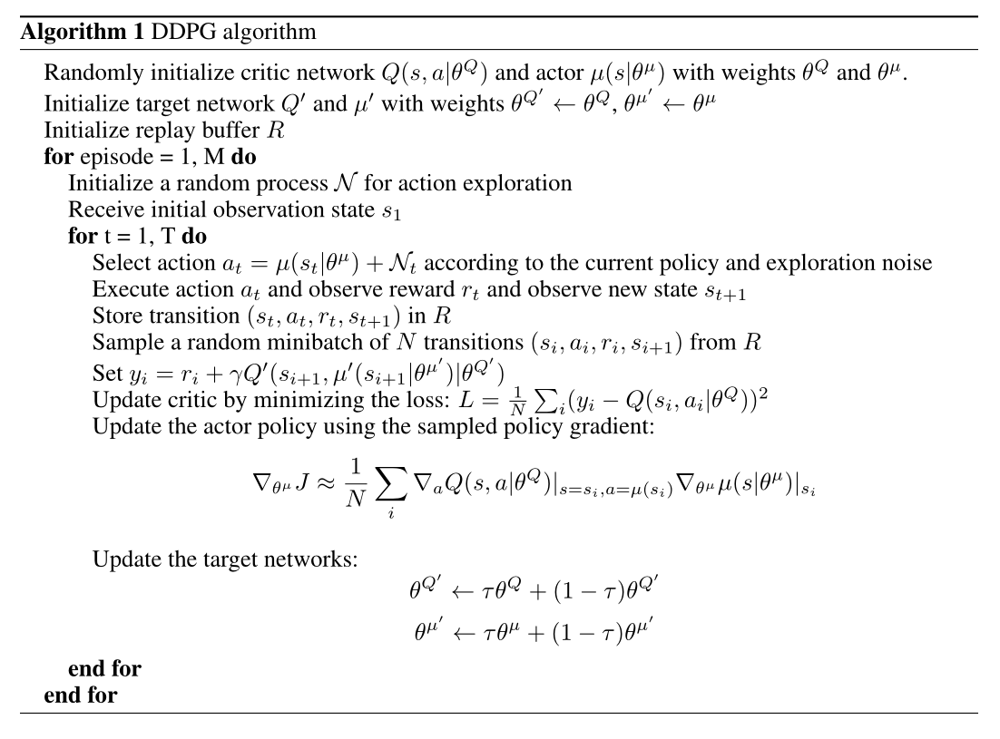
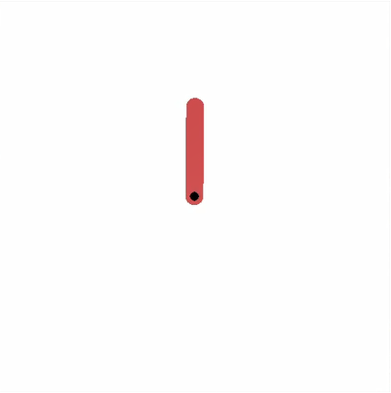
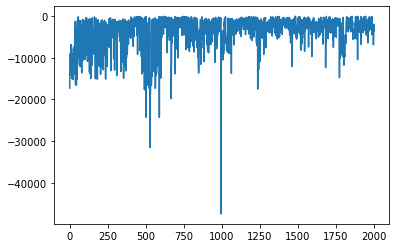

# 强化学习第一次实验作业报告——倒立摆问题

**姓名：樊宇**

**学号：2021E8018782022**


## 1. 环境建模

基于题目给出的倒立摆模型以及gym中给出的开源模型"Pendulum-v1", 可以构建出题目中所给出的倒立摆模型

其中观测状态空间(observation space)为:

| n    | observation   | min      | max        |
| ---- | ------------- | -------- | ---------- |
| 0    | $cos\theta$   | -1.0     | 1.0        |
| 1    | $sin(\theta)$ | -1.0     | 1.0        |
| 2    | $\dot \theta$ | -15$\pi$ | 15$\theta$ |

状态空间(state space)为:

| n    | state         | min      | max     |
| ---- | ------------- | -------- | ------- |
| 0    | $\theta$      | -$\pi$   | $\pi$   |
| 1    | $\dot \theta$ | -15$\pi$ | $15\pi$ |

动作空间(action space)为:

| n    | action | min  | max  |
| ---- | ------ | ---- | ---- |
| 0    | a      | -3   | 3    |

系统的离散时间动力学方程由欧拉法有:
$$
\begin{cases}
\alpha_{k+1} = \alpha_k + T_s \dot \alpha_k \\
\dot \alpha_{k+1} =\dot \alpha_k + T_s \frac{1}{J}(mglsin(\alpha)-b\dot\alpha-\frac{K}{R}\dot\alpha+\frac{K}{R}a)
\end{cases}
$$
其中各个参数由题中给出:

| params | values  |
| ------ | ------- |
| m      | 0.055   |
| g      | 9.81    |
| l      | 0.042   |
| J      | 1.91e-4 |
| b      | 3e-6    |
| K      | 0.0536  |
| R      | 9.5     |
| $T_s$  | 0.005   |

奖励函数为:
$$
R(s, a) = -5\alpha^2-0.1\dot\alpha^2-a^2
$$
对gym中的"Pendulum-v1"环境稍作修改:

```python
import gym
from gym import spaces
from gym.utils import seeding
import numpy as np
from os import path


class my_PendulumEnv(gym.Env):
    metadata = {"render.modes": ["human", "rgb_array"], "video.frames_per_second": 30}

    def __init__(self):
        self.max_speed = 15 * np.pi
        self.max_voltage = 3.0
        self.dt = 0.005

        # parameters
        self.g = 9.81
        self.m = 0.055
        self.l = 0.042
        self.J = 1.91e-4
        self.b = 3e-6
        self.K = 0.0536
        self.R = 9.5

        self.viewer = None

        # high limit of observation space
        high = np.array([1.0, 1.0, self.max_speed], dtype=np.float32)

        self.action_space = spaces.Box(low=-self.max_voltage, high=self.max_voltage, shape=(1,), dtype=np.float32)
        self.observation_space = spaces.Box(low=-high, high=high, dtype=np.float32)
        # action space: ([-3], [3])
        # observation space: ([-1, -1, -15pi], [1, 1, 15pi])


        self.seed()

    def seed(self, seed=None):
        self.np_random, seed = seeding.np_random(seed)
        return [seed]

    def step(self, u): # u is the action
        th, thdot = self.state  # th := theta

        g = self.g
        m = self.m
        l = self.l
        J = self.J
        b = self.b
        K = self.K
        R = self.R
        dt = self.dt

        u = np.clip(u, -self.max_voltage, self.max_voltage)[0]
        self.last_u = u  # for rendering
        costs = 5 * (angle_normalize(th) ** 2) + 0.1 * (thdot ** 2) + 1 * (u ** 2) # reward function

        newthdot = thdot + (1 / J) *(m * l * np.sin(th) - b * thdot - K * K / R *thdot + K / R * u) * dt # kinetic function
        newthdot = np.clip(newthdot, -self.max_speed, self.max_speed)
        newth = th + newthdot * dt

        self.state = np.array([newth, newthdot])
        return self._get_obs(), -costs, False, {}

    def reset(self):
        high = np.array([np.pi, 1])
        self.state = self.np_random.uniform(low=-high, high=high)
        self.last_u = None
        return self._get_obs()

    def _get_obs(self):
        theta, thetadot = self.state
        return np.array([np.cos(theta), np.sin(theta), thetadot], dtype=np.float32)

    def render(self, mode="human"):
        if self.viewer is None:
            from gym.envs.classic_control import rendering

            self.viewer = rendering.Viewer(500, 500)
            self.viewer.set_bounds(-2.2, 2.2, -2.2, 2.2)
            rod = rendering.make_capsule(1, 0.2)
            rod.set_color(0.8, 0.3, 0.3)
            self.pole_transform = rendering.Transform()
            rod.add_attr(self.pole_transform)
            self.viewer.add_geom(rod)
            axle = rendering.make_circle(0.05)
            axle.set_color(0, 0, 0)
            self.viewer.add_geom(axle)
            fname = path.join(path.dirname(__file__), "assets/clockwise.png")
            self.img = rendering.Image(fname, 1.0, 1.0)
            self.imgtrans = rendering.Transform()
            self.img.add_attr(self.imgtrans)

        self.viewer.add_onetime(self.img)
        self.pole_transform.set_rotation(self.state[0] + np.pi / 2)
        if self.last_u is not None:
            self.imgtrans.scale = (-self.last_u / 2, np.abs(self.last_u) / 2)

        return self.viewer.render(return_rgb_array=mode == "rgb_array")

    def close(self):
        if self.viewer:
            self.viewer.close()
            self.viewer = None


def angle_normalize(x):
    return ((x + np.pi) % (2 * np.pi)) - np.pi
```

然后在".../gym/envs/classic_control/\__init\__.py"下配置如下:

```python
from gym.envs.classic_control.pendulum_for_RL_lesson import my_PendulumEnv
```

以及在".../gym/envs/\__init\__.py"下做如下配置:

```python
register(
    id="Pendulum-v2",
    entry_point="gym.envs.classic_control:my_PendulumEnv",
    max_episode_steps=200,
)
```

完成以上工作就基本搭建好了本次作业需要的倒立摆模型


## 2. 算法

在本次作业当中, 采用了一种无模型的、离策略的、以及在Actor-Critic框架之下的强化学习算法--DDPG

算法总体流程如下:



### 2.1 逼近器

在本算法中, 需要定义4个神经网络以分别作为策略逼近器$\mu(s|\theta^\mu)$, 动作-价值逼近器$Q(s, a|\theta^Q)$, 目标策略逼近器$\mu'(s|\theta^{\mu'})$, 以及目标动作-价值逼近器$Q'(s, a|\theta^{Q'})$

进行TD误差的计算时, TD目标值的计算是通过目标策略逼近器$\mu'(s|\theta^{\mu'})$以及目标动作-价值逼近器$Q'(s, a|\theta^{Q'})$来计算的, 即:
$$
y_i = r_i+\gamma Q'(s_{i+1}, \mu'(s_{i+1}|\theta^{\mu }|\theta^{Q'}))
$$
而这两个目标网络参数的更新, 为了使其更稳定, 也采用了"soft update"的做法, 使其更新的过程变得很慢, 以达到保持目标网络稳定的目的:
$$
\theta^{Q'} = \tau\theta^Q + (1-\tau)\theta^{Q'} \\
\theta^{\mu'} = \tau\theta^\mu + (1-\tau)\theta^{\mu'} \\
\tau <<1
$$
动作-价值逼近器$Q(s, a|\theta^Q)$的更新则是根据TD误差, 以及从replay buffer中采样的一个mini-batch的数据, 计算他们的TD误差之和, 对神经网络参数进行求导:
$$
L = \frac{1}{N}\Sigma_i(y_i - Q(s_i, a_i|\theta^Q))^2 \\
\theta^Q = \theta^Q + \beta_1 \frac{d L}{d \theta^Q}
$$
策略逼近器$\mu(s|\theta^\mu)$d的更新则是根据策略梯度定理:
$$
\nabla_{\theta^\mu} J = \mathbb{E}_{\mu(s|\theta^\mu)}[\nabla_{\theta^\mu}log \mu(s|\theta^\mu)Q(s,a|\theta^Q)]
$$
同样的从replay buffer中采样一个mini-batch的数据去近似期望, 则更新策略为:
$$
\nabla_{\theta^\mu} J \approx \frac{1}{N}\sum_i\nabla _aQ(s,a|\theta^Q)|_{s=s_i, a=\mu(s_i)}\nabla_{\theta^\mu}log \mu(s|\theta^\mu)|_{s_i}\\
\theta^\mu = \theta^\mu + \beta_2\nabla_{\theta^\mu} J
$$

### 2.2 Replay Buffer

每次采样的状态动作序列$(s_i, a_i, r_{i+1}, s_{i+1})$并不直接用于更新参数, 因为这样的数据没有随机性, 而是具有时序性的, 为了数据分布的随机性, 算法采用了replay buffer, 将每次采样的动作状态序列存储到回放经验池当中, 当回放经验池满后, 再从中随机抽取一个mini-batch, 用于更新参数.

### 2.2 离策略

为了增强动作的探索性, 每次采样状态动作序列时, 并不是直接根据策略逼近器来采样, 而是保留一定的随机性
$$
a_t = \mu(s_t|\theta^\mu) + N_t
$$
$N_t$为探索噪声


## 3. 算法实现

```python
from re import X
from turtle import forward
import gym
import math
import random
import numpy as np
import matplotlib.pyplot as plt
import torch
import torch.nn as  nn
import torch.nn.functional as F
import torch.optim as optim

class Actor(nn.Module):
    def __init__(self, input_size, hidden_size, output_size):
        super(Actor, self).__init__()
        self.linear1 = nn.Linear(input_size, hidden_size)
        self.linear2 = nn.Linear(hidden_size, hidden_size)
        self.linear3 = nn.Linear(hidden_size, output_size)
    
    def forward(self, s):
        x = F.relu(self.linear1(s))
        x = F.relu(self.linear2(x))
        x = 3 * torch.tanh(self.linear3(x)) 
        
        return x

class Critic(nn.Module):
    def __init__(self, input_size, hidden_size, output_size):
        super().__init__()
        self.linear1 = nn.Linear(input_size, hidden_size)
        self.linear2 = nn.Linear(hidden_size, hidden_size)
        self.linear3 = nn.Linear(hidden_size, output_size)
    
    def forward(self, s, a):
        x = torch.cat([s, a], 1)
        x = F.relu(self.linear1(x))
        x = F.relu(self.linear2(x))
        x = self.linear3(x)

        return x

class Agent(object):
    def __init__(self, **kwargs):
        for key, value in kwargs.items():
            setattr(self, key, value)
        
        s_dim = self.env.observation_space.shape[0]
        a_dim = self.env.action_space.shape[0]

        self.actor = Actor(s_dim, 256, a_dim)
        self.actor_target = Actor(s_dim, 256, a_dim)
        self.critic = Critic(s_dim + a_dim, 256, a_dim)
        self.critic_target = Critic(s_dim + a_dim, 256, a_dim)
        self.actor_optim = optim.Adam(self.actor.parameters(), lr = self.actor_lr)
        self.critic_optim = optim.Adam(self.critic.parameters(), lr = self.critic_lr)
        self.buffer = []

        self.actor_target.load_state_dict(self.actor.state_dict())
        self.critic_target.load_state_dict(self.critic.state_dict())

    def act(self, s0):
        s0 = torch.tensor(s0, dtype = torch.float).unsqueeze(0)
        a0 = self.actor(s0).squeeze(0).detach().numpy()
        return a0
    
    def put(self, *transition):
        if len(self.buffer) == self.capacity:
            self.buffer.pop(0)
        self.buffer.append(transition)
    
    def learn(self):
        if len(self.buffer) < self.batch_size:
            return
        
        samples = random.sample(self.buffer, self.batch_size)

        s0, a0, r1, s1 = zip(*samples)

        s0 = torch.tensor(s0, dtype = torch.float)
        a0 = torch.tensor(a0, dtype = torch.float)
        r1 = torch.tensor(r1, dtype = torch.float)
        s1 = torch.tensor(s1, dtype = torch.float)

        def critic_learn():
            a1 = self.actor_target(s1).detach()
            y_true = r1 + self.gamma * self.critic_target(s1, a1).detach()
            y_pred = self.critic(s0, a0)
            loss_fn = nn.MSELoss()
            loss = loss_fn(y_pred, y_true)
            self.critic_optim.zero_grad()
            loss.backward()
            self.critic_optim.step()
        
        def actor_learn():
            loss = - torch.mean(self.critic(s0, self.actor(s0)))
            self.actor_optim.zero_grad()
            loss.backward()
            self.actor_optim.step()
        
        def soft_upgrade(net_target, net, tau):
            for target_param, param in zip(net_target.parameters(), net.parameters()):
                target_param.data.copy_(target_param.data * (1.0 - tau) + param.data * tau)
        
        critic_learn()
        actor_learn()
        soft_upgrade(self.critic_target, self.critic, self.tau)
        soft_upgrade(self.actor_target, self.actor, self.tau)

```

```python
from DDPG import Agent
import gym
import numpy as np
import torch

if __name__ == '__main__':

    env = gym.make('Pendulum-v2')
    env.reset()
    env.render()

    params = {
        'env': env,
        'gamma': 0.98,
        'actor_lr': 0.001,
        'critic_lr': 0.001,
        'tau': 0.02,
        'capacity': 10000,
        'batch_size': 32
    }

    agent = Agent(**params)

    record = [-99999]

    for episode in range(2000):
        s0 = env.reset()
        episode_reward = 0

        for step in range(500):
            env.render()
            a0 = agent.act(s0)
            s1, r1, done, _ = env.step(a0)
            agent.put(s0, a0, r1, s1)

            episode_reward += r1
            s0 = s1

            agent.learn()
        if episode_reward >= max(record):
            torch.save(agent.actor.state_dict(), 'actor.pt')
        record.append(episode_reward)
        print(episode, ':', episode_reward)
    
    np.savetxt('record.txt', record)

```


## 4. 算法效果



算法的实验效果如上图所示, 在训练2000个episodes之后, 选择其中reward最大的模型, 对于任意给定的初始角度, 都能倒立摆一直保持在顶上

算法的reward函数随着训练episodes的增加也总体趋向于收敛



## 5. 讨论与分析

经过实验发现, 并不是训练的次数越多的模型效果越好, 训练的次数越多, 虽然总体上是越来越收敛的, 但是起伏比较大, 因此最终选用的模型是在训练过程中reward最小的模型

经过分析与思考, 猜想其中的原因可能是:

- 由于每次倒立摆的初始位置是随机的, 而reward函数中关于角度的惩罚因子又较大, 因此相对来说比较好的策略可能会因为初始位置的不好而被认为是不好而进行梯度更新
- reward函数关于角速度的惩罚因子相对较小, 因此, 训练初期使得倒立摆更加注重角度而比较不重视角速度的大小, 使得倒立摆的角速度偏大, 使得倒立摆一直在转而停不下来导致reward偏大
